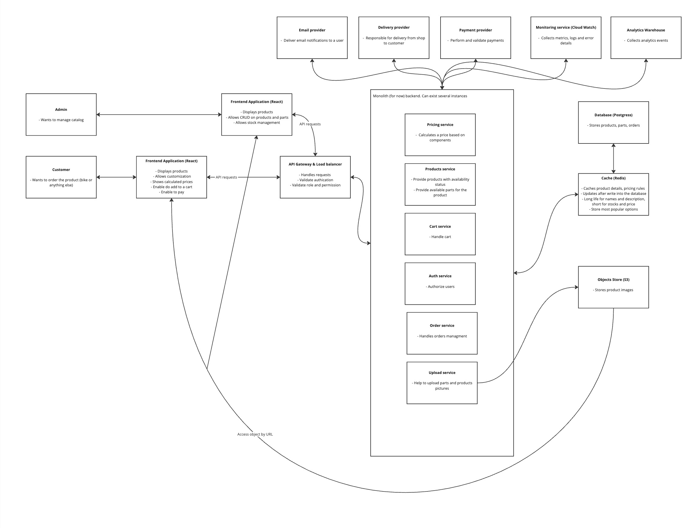

## Bicycle Shop

Welcome to the Bicycle sho repository! This document provides an overview of the system's architecture, design, and database, along with relevant diagrams for better understanding.
C4 Model Diagrams

2 main diagrams from C4 Model:

System Context Diagram

 

 

Container Diagram

## Flow Diagram

The Flow for a client of the shop

 

User Flow Diagram

 

Markus add product Flow Diagram

## Architecture Design: Monolith

This project uses a Monolith Architecture design.     
- [Why this desion was made](./architecture-decision.md) 

# Database Scheme

 

Database diagram

## Key Features

### 1. Product Customization
Product Entities:
- Product: High-level product details (e.g., bicycle).
- Part: Components of the product (e.g., frame, wheels).
- PartOption: Specific options for each part (e.g., "Mountain Wheels", "Road Wheels").
- ProhibitedCombination: Prevents invalid configurations (e.g., "Mountain Wheels" with "Diamond Frame").

Cart and Orders
- Cart: Manages items added by customers (authenticated or anonymous).
- CartProduct: Links products to carts.
- CartItem: Tracks selected options for each product in the cart.
- Order: Stores confirmed customer purchases.
- OrderProduct and OrderItem: Detail product and part configurations for each order.

### Why Product and Cart and Orders Are Separated
Cart tables manages dynamic user-specific interactions. Order stores history with all the details. Product are for the catalog. Separation avoids duplication, ensures consistency, and supports both anonymous and authenticated users.

### Why JSON Is Used for Conditions in PricingRule
JSON allows flexible and dynamic storage of complex pricing rules without requiring frequent schema changes. We can adjust rules not only based on some other parts, but also for quanity, weight and etc

## Used tools:
- Node.js + Nest.js as main frameworks
- Redis for cache
- Postgress for database
- Swagger for API documentations (in progress)
- AWS API Gateway for handling requests 
- AWS ALB for balancing load between instances
- AWS EC2 for hosting 
- AWS S3 for hosting objects
- AWS CloudWatch and Sentry for loging and monitoring (in progress)